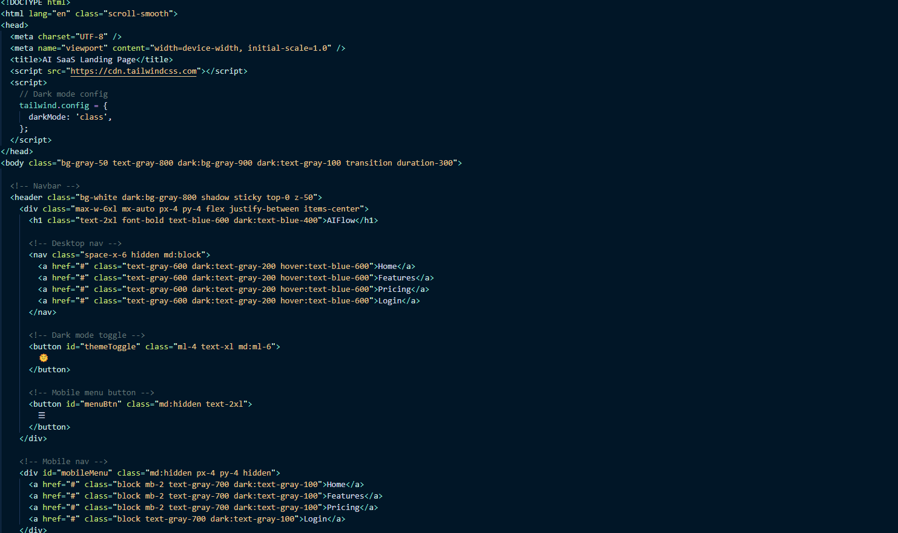

# AIFlow – Tailwind CSS Landing Page

A clean, responsive, and modern SaaS landing page built using Tailwind CSS. Includes:

- Mobile-friendly layout
- Dark mode toggle 🌞🌙
- Responsive navbar with toggle
- Simple, clean design

## 🔧 How to Use

1. Open `index.html` in your browser
2. Edit content or customize with your own branding
3. Use it in any static project (no build step needed!)

## 🖼️ Preview

## 📄 License

Personal and commercial use allowed. No resale as-is or redistribution.